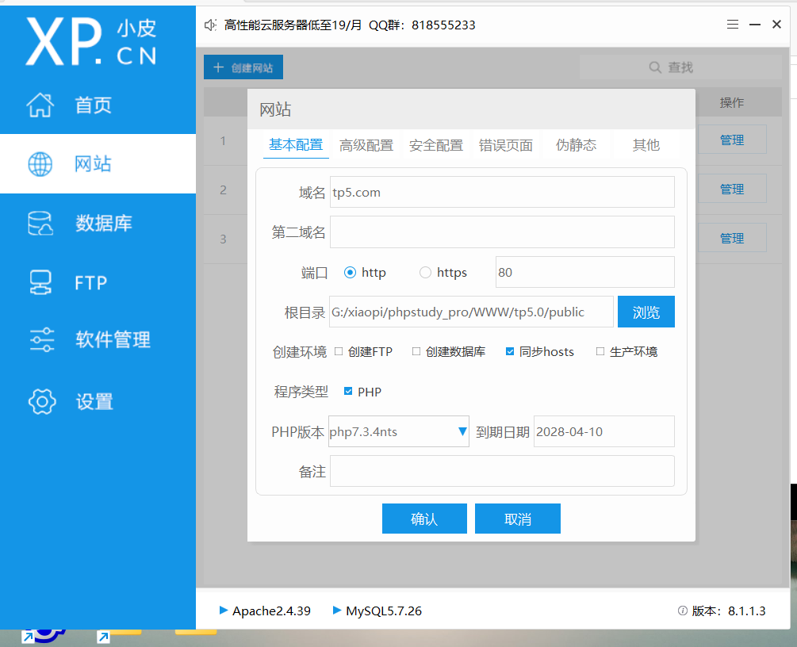

# myphp-tp5

#### 介绍
用php tp5写的两个项目
一个新闻网站
一个投票系统

#### 文件介绍

tp5.0/application/vote 是投票系统

tp5.0/application/news 是新闻系统

data/news.sql 是新闻的数据库

vote/news.sql 是投票的数据库

#### 软件环境

语言:php

框架:tp5

前端ui是bootstrap

配置: 配置在自己的WWW下面就行  

### 投票系统

#### 介绍

比赛管理:比赛的增删改查

选手管理:选手的增删改查,可以更改选手的成绩，可以将选手加入现有的比赛

评委管理:评委的增删改查，可以将评委加入现有的比赛

用户管理:用户的增删改查

报名管理:批准比赛

选手报名:选手登录系统查看比赛选手选择报名比赛

评委评分:小程序登录选择比赛对选手打分

运行:管理员tp5.com/index.php/vote/admin/login

用户tp5.com/index.php/vote/user/login

#### 部分演示

### 新闻系统

#### 介绍

新闻管理:新闻的增删改查,加入新闻时选择类别

分类管理:对分类的增删改查

广告管理:对广告的增删改查

新闻获取:可以通过热门信息 搜索 分页 获取新闻,查看新闻详情

运行:管理员:tp5.com/index.php/news/manager/adv

用户:tp5.com/index.php/news/user/index

#### 部分演示

